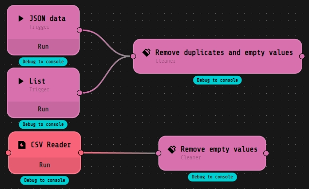

# :paintbrush: loko-cleaner
A Loko-AI extension which allows to clean input data by removing duplicates from a JSON objects list or by replacing None or empty values with a specified non-empty value.
Have you ever tried to import a CSV file or a JSON list of objects into, for example, an SQL based database? How many times have you seen the "Cannot insert the value NULL into column 'column_name'"? With this extension you can clean and sanitize data before the database import.

# :wrench: How does it work?
loko-cleaner deep dives into any input list, with heterogeneous or non-heterogeneous values. It searches for duplicates and keeps only the first occurrence. It also can search for None or empty values that can be replaced with any custom value.

### Configuration
The switch ***Output as a list*** allows user to output cleaned data inside a single list, instead of iterating through each output value.
Users can decide whether clean duplicates or replace None/empty values or both with the corresponding switches.\
If ***Remove Duplicates*** is switched on and input data is a JSON objects list, users can specify a discriminating key to decide whether there is a duplicate or not, users can also ignore "missing key" errors by toggling the ***Ignore error*** switch.\
If ***Replace None or empty values*** is switched on, users can specify a custom value. This value is used to fill None or empty values of the input data.

### Input
A list of JSON objects or a list of heterogeneous and non-heterogeneous values.

### Output
Same as input but without duplicates or with None/empty values filled with the custom value.

# :rocket: Getting Started
1. Open Loko-AI, go to ***Projects*** and click on ***Import from git***\

2. Copy [this link](https://github.com/tepiddust/loko-cleaner.git), paste into the ***Url*** field of the dialog box and click ***Import***\

3. Open the project and click on the ***Play*** button next to the project name\

4. Before running the flow for the first time:
   - Double-click on the ***CSV Reader*** component to open the component settings
   - Click on ***Upload*** and then select the ***example.csv*** file from the cloned extension folder: ***`<User Folder>`/loko/projects/loko-cleaner***
   - Select the newly uploaded file and click ***Save***
5. Enjoy!\
